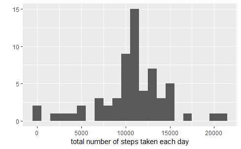
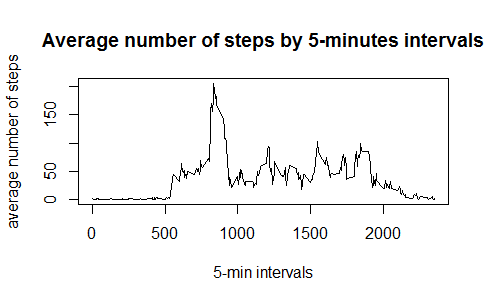
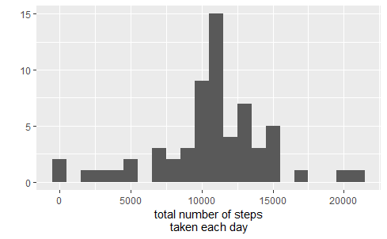
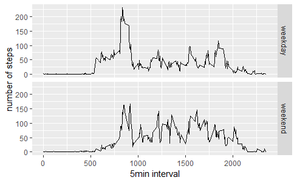

# Reproducible Research: Peer Assessment 1

## loading and preprocessing the data
```{r loaddata}
data <- read.csv("C:/Users/szhang/Desktop/class materials/RepData_PeerAssessment1/activity.csv")
```

## What is mean total number of steps taken per day?
```{r}
library(ggplot2)
total.steps <- tapply(data$steps, data$date, FUN = sum, na.rm=TRUE)
qplot(total.steps,binwidth=1000, xlab="total number of steps taken each day")
```


```r
mean(total.steps, na.rm = TRUE)
```
```
## [1] 9354
```
```r
median(total.steps,na.rm = TRUE)
```
```
## [1] 10395
```

## What is the average daily activity pattern?
```{r}
averages <- aggregate(steps ~ interval, data = data, FUN = mean, na.rm = TRUE)
plot(steps ~ interval, data = averages, type = "l",
       ylab = "average number of steps", xlab="5-min intervals",
       main="Average number of steps by 5-minutes intervals")
```
 

Which 5-minute interval, on average across all the days in the dataset, contains the maximum number of steps?

```{r}
averages[which.max(averages$steps),]
```
```
##     interval steps
## 104      835 206.2
```

## Imputing missing values

NOte that there are many days/intervals where there are missing values (coded as `NA`). The presence of missing days may introduce bias into some calculations or summaries of the data.
```{r calculate total number of missing}
missing<-is.na(data$steps)
table(missing)
```
```
## missing
## FALSE  TRUE 
## 15264  2304
```
# Replace each missing value with the mean value of its 5-minute interval
```{r}
fill.value<-function(steps,interval){
  filled<-NA
  if (!is.na(steps))
    filled<- c(steps)
  else
    filled <- (averages[averages$interval==interval,"steps"])
  return(filled)
}
fill.data <-data
fill.data$steps <-mapply(fill.value, fill.data$steps,fill.data$interval)
```
# Make a histogram of the total number of steps taken each day and Calculate and report the mean and median total number of steps taken per day.

```{r}
total.steps <-tapply(fill.data$steps, fill.data$date, FUN =sum)
qplot(total.steps, binwidth = 1000,  xlab="total number of steps taken each day")
```


```r
mean(total.steps)
```
```
## [1] 10766
```
```r
median(total.steps)
```
 ```
## [1] 10766
```

mean and median are greater after replacing missing data. 

## Are there differences in activity patterns between weekdays and weekends?

```{r}
weekday.weekend <- function(date){
  day <-weekdays(date)
  if (day %in% c("Monday", "Tuesday","Wednesday","Thursday","Friday"))
    return("weekday")
  else if (day %in% c("Saturday","Sunday"))
    return("weekend")
  else
    stop("invalid date")
}
fill.data$date <- as.Date(fill.data$date)
fill.data$day <-sapply(fill.data$date, FUN=weekday.weekend)
```
plot containing a time series plot (i.e. type = "l") of the 5-minute interval (x-axis) and the average number of steps taken, averaged across all weekday days or weekend days (y-axis).
```{r}
interval.averages <- aggregate(steps ~ interval  + day, data = fill.data, mean)
ggplot(interval.averages, aes(interval, steps)) + geom_line()+
  facet_grid(day ~ .) + xlab("5min interval") + ylab("number of steps")
  ```
 
#another way to plot: make them in the same graph
```r
plot(steps ~ interval , data = interval.averages, type = "l",
     layout = c(1,2), ylab = "Number of steps", xlab="5-min.interval", main = "Average  5-min. activity intervals: Weekdays vs. Weekends")

```
